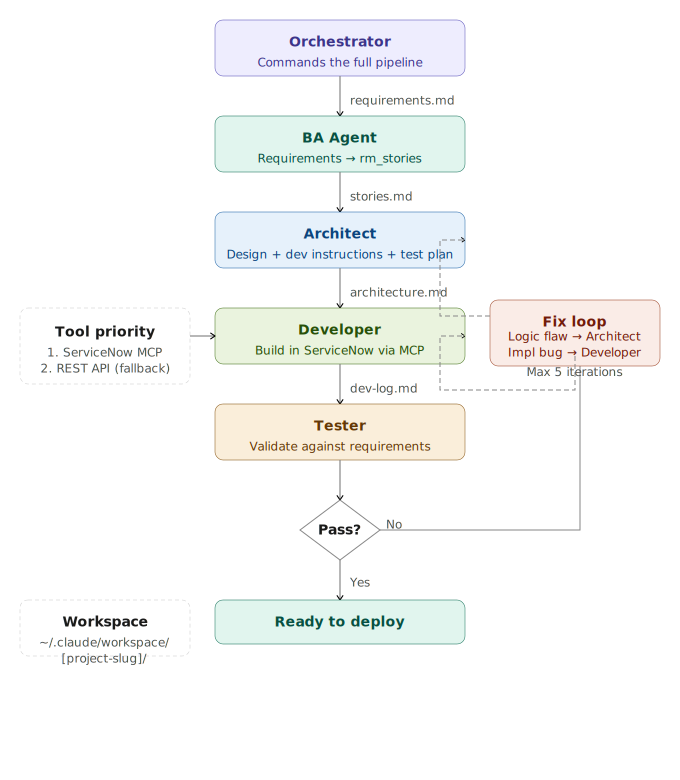

# ClaudeCodeAgents
A team of specialized Claude Code agents for end-to-end ServiceNow scoped application development — with built-in change governance.



---

## Agents

### Orchestrator
Master pipeline controller that commands the full development team in sequence. Receives client requirements, creates a workspace, and drives BA → Architect → Governance → Developer → Tester through to a passing test result. Handles fix loops automatically (up to 5 iterations), routing failures back to the correct agent based on failure type.

### BA Agent (Business Analyst)
Transforms raw client requirements (free text, bullet points, meeting notes) into structured `rm_story` records grounded in official ServiceNow documentation. Consults the ServiceNowDocs repo via an index before writing stories, identifies ambiguities, and refines output iteratively.

### Architect
Translates rm_stories into a precise technical design and actionable developer instructions. Produces a full `architecture.md` (components, build order, scoped app rules, risks) and a structured `test-plan.md` that traces every test back to an acceptance criterion. In fix loops, revises only the affected sections.

### Governance Gate
Change control checkpoint between Architect and Developer. Reads the architecture plan without touching ServiceNow, validates that the active update set is correct, checks that no component uses Global scope unless explicitly approved, and lists every cross-scope call for user acknowledgement. Produces a `change-manifest.md` (a full preview of every planned write) and requests an explicit human YES before the Developer is allowed to proceed. A single unapproved Global usage or wrong update set blocks the pipeline entirely.

### Developer
Builds every component in ServiceNow following the Architect's instructions exactly and in dependency order. Reads `governance-approval.md` before doing anything — stops immediately if it is not APPROVED. Routes each component type to the correct dispatcher skill (Business Rules, Client Scripts, Flows, ACLs, etc.), enforces scoped app prefixing, and logs all results to `dev-log.md`. Never deploys — that step is human-controlled.

**Dependency: [ponytail](https://github.com/DietrichGebert/ponytail)**
The Developer agent uses ponytail to enforce a "laziest senior dev" mindset — preferring OOTB platform capabilities, existing APIs, and native flows over custom code. The best code is the code you never wrote.

### Tester
Independent QA gate that validates the built solution against the original requirements. Executes the Architect's test plan, cross-checks the dev log for skipped or failed components, produces a requirements-coverage matrix, and outputs a final PASS/FAIL verdict with classified failures to route back into the fix loop.

### Dispatcher
General-purpose entry point for any ServiceNow or full-stack development task. Loads a skill index of 185+ skills at startup, classifies the request by domain, and routes to the correct skill automatically. Covers ITSM, CSM, HRSD, development, GenAI, admin, security, GRC, catalog, CMDB, and general coding (JS, Python, React, Node).

---

## Rule of thumb
- Small task → **Dispatcher**
- Full feature → **Orchestrator**

---

## Pipeline

```
Requirements → BA → Architect → Governance Gate → Developer → Tester
                                      ↑                           |
                                      |        (fix loop)         |
                                      └───── Architect ←──────────┘
```

The Governance Gate is the read/write boundary. Everything before it is planning. Everything after it writes to ServiceNow. No write reaches the platform without a human YES.

---

## Invocation

### Start a full development pipeline
```bash
claude --agent orchestrator "build a proactive case communication feature for CSM"
```

### Quick one-off task
```bash
claude --agent dispatcher "fix business rule on incident table"
```

### Inside a Claude Code session
```
/agent orchestrator
```
Then describe your requirement when prompted.

---

## Agent structure
```
~/.claude/agents/
  orchestrator.md   ← commands everyone
  ba-agent.md
  architect.md
  governance.md     ← change control gate (new)
  developer.md      ← requires ponytail; blocked without governance approval
  tester.md
  dispatcher.md
```

---

## Workspace

Each pipeline run creates a workspace with handoff artifacts:

```
~/.claude/workspace/[project-slug]/
  requirements.md          ← raw client input
  stories.md               ← BA output (rm_stories)
  architecture.md          ← Architect design + dev instructions
  test-plan.md             ← Architect test plan
  change-manifest.md       ← Governance: full preview of planned writes
  governance-approval.md   ← Governance: approval token read by Developer
  dev-log.md               ← Developer build log
  test-results.md          ← Tester results
  status.md                ← Current pipeline state
```

---

## Governance Model

The Governance Gate enforces three rules before any write reaches ServiceNow:

| Rule | Behaviour |
|---|---|
| Update set must be active and `In Progress` | Pipeline BLOCKED if wrong or missing |
| Global scope is never the default | Any Global usage requires explicit user approval |
| Cross-scope calls must be listed | User must acknowledge them before proceeding |

Governance outcomes:

| Outcome | Next step |
|---|---|
| **APPROVED** | Developer proceeds |
| **REJECTED** | User's change request sent back to Architect |
| **BLOCKED** | Pipeline stops; violations must be resolved before re-running |

---

## Dependencies

| Agent | Dependency | Purpose |
|---|---|---|
| BA + Architect + Developer | [ServiceNowDocs](https://github.com/ServiceNow/ServiceNowDocs) | Official platform docs via `search_docs` MCP tool |
| Developer | [ponytail](https://github.com/DietrichGebert/ponytail) | Enforces OOTB-first, minimal custom code approach |

### Setup

**ServiceNowDocs**
```bash
git clone https://github.com/ServiceNow/ServiceNowDocs.git
export SERVICENOW_DOCS_PATH=/path/to/ServiceNowDocs
```

**ponytail**
Follow install instructions at https://github.com/DietrichGebert/ponytail

---

## Tool Priority

All agents that interact with ServiceNow **must** follow this order:

| Priority | Tool | When |
|---|---|---|
| 1st | **ServiceNow MCP server** (`/mcp`) | Always — use first |
| 2nd | **REST API** | Only if MCP is unavailable or unsupported |
| 3rd | **Manual / scripted** | Last resort only |

The Developer agent enforces this on every build step. MCP unavailability is logged in `dev-log.md`.
